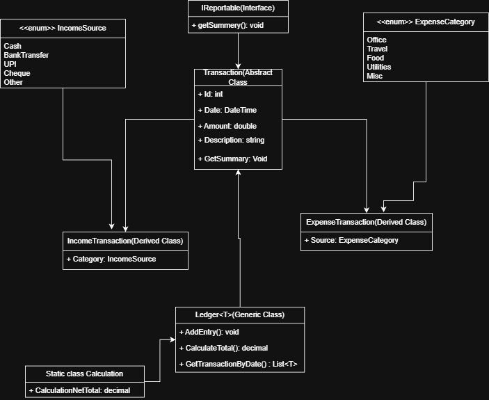

# Digital Petty Cash Ledger

hey! so this is basically a simple app to track petty cash - you know, those small expenses like tea, snacks, stationery and stuff.

## What does it do?

it's a console app where you can:
- add income (when you get money from main office)
- add expenses (when you spend on something)
- check totals (how much came in, how much went out, what's left)
- see all transactions history

## The Tech Stuff

made this using C# to practice OOP concepts like:
- **inheritance** - both income and expense inherit from a base Transaction class
- **generics** - the Ledger<T> can work with any transaction type
- **interfaces** - IReportable makes sure everything can print a summary
- **enums** - for categories and sources

## Class Diagram



### The Classes

**Transaction (abstract)** - base class with common stuff like id, date, amount, description

**IncomeTransaction** - for money coming in, has a Source (Cash, UPI, Bank Transfer, etc)

**ExpenseTransaction** - for money going out, has a Category (Office, Food, Travel, etc)

**Ledger<T>** - generic class that stores transactions in a list and can calculate totals

**Calculation** - just a helper class to calculate net balance (income - expenses)

## How to Run

```bash
dotnet run
```

then just follow the menu:
1. Add Income
2. Add Expense  
3. Show Totals
4. Show All Transactions
5. Exit

## Testing

you can use this test data:
- add income: $500 from Cash
- add expense: $20 for Office Stationery
- add expense: $15 for Team Snacks
- check totals: should show $465 remaining

### Quick Test Input

if you wanna test fast, just copy paste these lines one by one:
```
1
1
500
Replenishment from Main Office
0
2
1
20
Office Stationery
0
2
2
15
Team Snacks
2
4
3
5
```

## What I Learned

- how to use generics properly with constraints
- abstract classes vs interfaces (when to use which)
- keeping code organized with multiple files
- basic financial tracking logic

pretty happy with how it turned out! the generic ledger was tricky at first but makes sense now.
